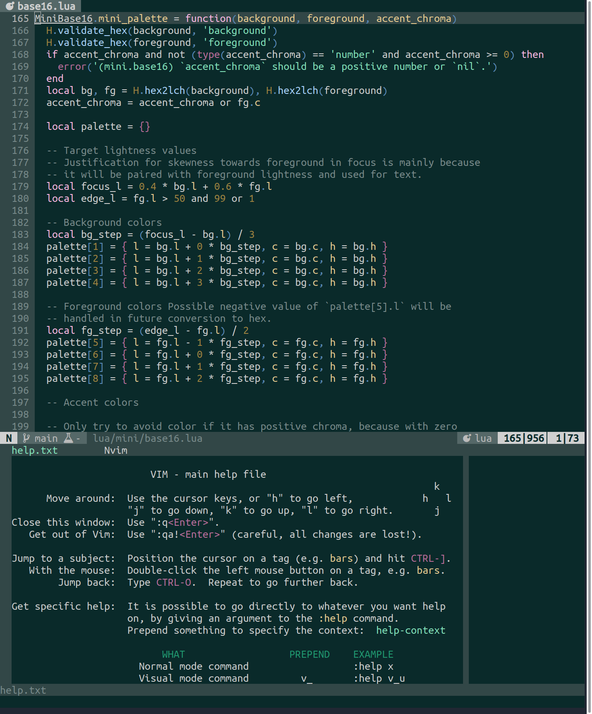
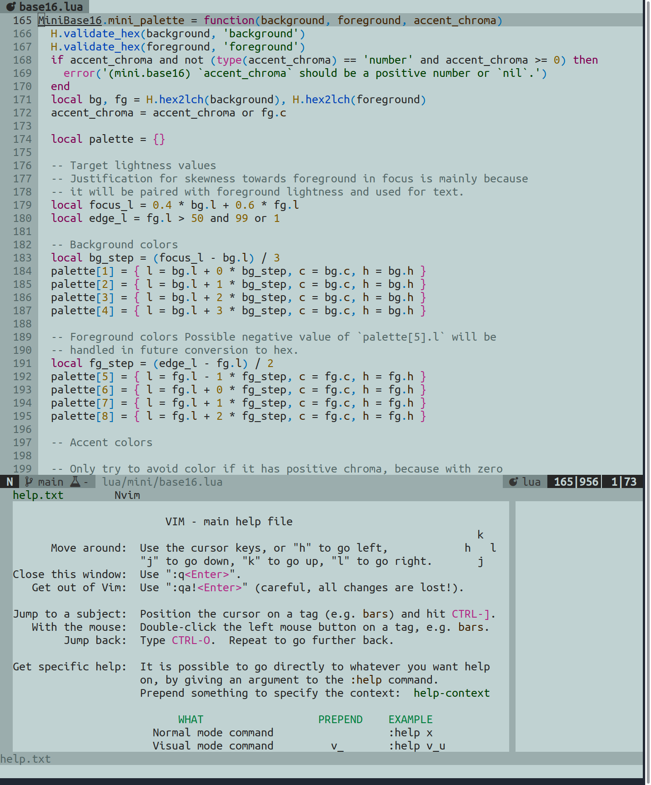

*원래 [Reddit에 게시됨](https://www.reddit.com/r/neovim/comments/wsboke/mininvim_color_updates_25_new_plugin_integrations/)*

안녕하세요, Neovim 사용자 여러분!

Neovim>=0.5 경험을 최소한의 노력으로 개선하는 20개 이상의 독립적인 Lua 플러그인 모음인 ['mini.nvim'](https://github.com/nvim-mini/mini.nvim)의 색상 관련 업데이트에 대해 게시하고자 합니다:

- ['mini.base16'](https://github.com/nvim-mini/mini.nvim/blob/main/readmes/mini-base16.md)에 25개의 새로운 플러그인 통합이 추가되었으며, 생성되는 하이라이트 그룹을 세밀하게 제어할 수 있는 옵션이 추가되었습니다 (귀중한 시작 시간을 단축하기 위해). 여기 [사용 가능한 통합의 전체 목록](https://github.com/nvim-mini/mini.nvim/blob/cc8d6bca1be014c865d99f19882bfc2549c8484e/doc/mini.txt#L1027-L1056)과 [제어 방법](https://github.com/nvim-mini/mini.nvim/blob/cc8d6bca1be014c865d99f19882bfc2549c8484e/doc/mini.txt#L1159-L1175)이 있습니다. 솔직히 말씀드리면, 모든 통합이 명시적인 것은 아닙니다 (즉, 새로운 하이라이트 그룹이 생성되는 것은 아닙니다). 일부는 제가 굳이 덮어쓰지 않기로 선택한 매우 훌륭한 기본값을 가지고 있습니다 (예: 'nvim-lualine/lualine.nvim'). 그럼에도 불구하고 조정이 필요한지 확인하기 위해 수시로 모니터링할 예정입니다.
- 새로운 'minicyan' 색상 테마가 추가되었습니다 (위 스크린샷 참조). 이는 'mini.base16'의 자체 [팔레트 생성기](https://github.com/nvim-mini/mini.nvim/blob/c1866193e1660fc02a2bc09c69e653d251b69b33/doc/mini.txt#L1114)를 통해 만들어졌습니다. 읽기 쉽고 일관된 base16 팔레트를 생성하기 위해 전경색, 배경색 및 엑센트 크로마(chroma) 값만 있으면 됩니다 (솔직히 말씀드리면 왠지 모르게 정말 자랑스럽습니다). 청록색(cyan)과 회색을 기본 색상으로 사용하여 중간 정도의 대비와 채도를 가진 팔레트가 되었습니다. 기본 청록색은 [인기 있는 Neovim 색상 테마 기여](https://echasnovski.com/blog/2022-07-20-i-contributed-to-toprated-neovim-color-schemes.html) 여정에서 영감을 얻었습니다.

빠르고 기능이 풍부한 색상 테마를 찾고 계신다면, 팔레트 생성기가 포함된 'mini.base16'을 사용해 보시고 의견을 들려주세요. 감사합니다!

(참고: [mason.nvim](https://github.com/mason-org/mason.nvim)의 UI에 **정말로** 깊은 인상을 받았습니다. 아직 확인하지 않으셨다면 꼭 확인해 보세요.)
