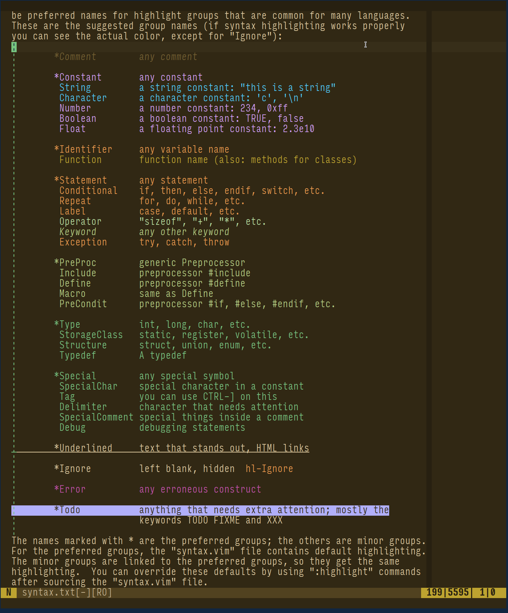

*원래 [Reddit에 게시됨](https://www.reddit.com/r/neovim/comments/12o5t8l/minicolors_tweak_and_save_any_color_scheme_plus/)*



안녕하세요, Neovim 사용자 여러분!

**모든** 색상 테마를 수정하고 저장할 수 있는 [mini.nvim](https://github.com/nvim-mini/mini.nvim)의 새로운 모듈 [mini.colors](https://github.com/nvim-mini/mini.nvim/blob/main/readmes/mini-colors.md)의 출시를 발표합니다. [별도의 GitHub 저장소](https://github.com/nvim-mini/mini.colors)를 통해서도 설치할 수 있습니다.

이 모듈은 색상 이론(아름다운 [Oklab](https://bottosson.github.io/posts/oklab/) 색 공간의 발견으로 이어진)에 대한 깊은 탐구와 사용자가 자신의 취향에 맞게 모든 색상 테마를 조정할 수 있는 도구를 만들고자 하는 열망이 결합된 결과물입니다.

예를 들어, 따뜻한 느낌의 Tokyonight는 어떤 모습일지 궁금해한 적이 있으신가요? 'mini.colors'를 사용하면 `chan_invert('temperature')` 호출 한 번으로 확인할 수 있습니다. 결과는 다음과 같습니다:

혹은 색상 테마 간의 애니메이션 전환을 원하신 적이 있나요? `:colorscheme` 명령을 `:Colorscheme`으로 바꾸기만 하면 됩니다!

'mini.colors'의 주요 기능은 다음과 같습니다:

- 색상 테마 객체 생성: 수동으로 생성하거나 현재 활성화된 테마를 포함하여 존재하는 테마를 조회하여 생성합니다.

- 색상 테마 데이터 유추 및 수정:
    - 배경색을 제거하여 투명도 추가 (터미널 에뮬레이터의 투명도 지원 필요).
    - GUI 색상을 기반으로 cterm 속성을 유추하여 'notermguicolors'와 호환되도록 함.
    - 하이라이트 그룹 링크 해결.
    - 불필요한 하이라이트 그룹을 제거하여 압축.
    - 사용된 색상 팔레트 추출 및 이를 기반으로 터미널 색상 유추.

- 취향이나 목표에 맞게 색상 수정:
    - 색상 16진수 문자열에 임의의 함수 적용.
    - 채널 업데이트 (밝기, 채도, 색조, 온도, 빨강, 초록, 파랑 등).
      자체 함수를 사용하거나 구현된 메서드 중 하나를 사용합니다:
        - 채널에 값을 더하거나 계수를 곱함. 예를 들어 모든 색상을 더 선명하게(덜 회색으로) 만들기 위해 "모든 색상의 채도에 10 추가" 또는 "채도에 2 곱하기".
        - 반전. 어두운/밝은 테마 간의 전환을 위해 "밝기 반전".
        - 하나 이상의 값으로 설정 (현재 값과 가장 가까운 값을 선택). 단색 또는 이색 테마를 만들기 위해 "하나 또는 두 개의 색조로 설정".
        - 특정 소스로부터 멀어지게 함 (가까운 값일수록 효과가 강함). 색상 테마에서 빨간색을 제거하기 위해 "색조 30에서 멀어지게 함". 멀어지는 정도(repel hue)는 설정 가능합니다.
    - 색각 이상 시뮬레이션.

- 색상 테마가 준비되면 바로 적용하여 효과를 확인하거나, 완전히 작동하는 별도의 색상 테마로 Lua 파일에 저장합니다.

- 피드백과 함께 대화형으로 실험.

- `MiniColors.animate()` 또는 `:Colorscheme` 사용자 명령을 사용하여 색상 테마 간의 애니메이션 전환.

- 지원되는 색 공간 내에서 변환 (`MiniColors.convert()`):
    - 16진수 문자열 (Hex).
    - 8비트 숫자 (터미널 색상).
    - RGB.
    - Oklab, Oklch, Okhsl.

실전 학습을 위해 ["Tweak 빠른 시작"](https://github.com/nvim-mini/mini.nvim/blob/main/readmes/mini-colors.md#tweak-quick-start) (데모 재현) 및 [일반적인 작업을 위한 레시피](https://github.com/nvim-mini/mini.nvim/blob/main/doc/mini-colors.txt#L104)가 준비되어 있습니다.

자세한 내용은 [도움말 파일](https://github.com/nvim-mini/mini.nvim/blob/main/doc/mini-colors.txt)을 참조하세요.

사용해 보시고 의견을 들려주세요! 여기 댓글이나 [전용 베타 테스트 이슈](https://github.com/nvim-mini/mini.nvim/issues/301)를 통해 피드백을 주시면 감사하겠습니다.

감사합니다!
