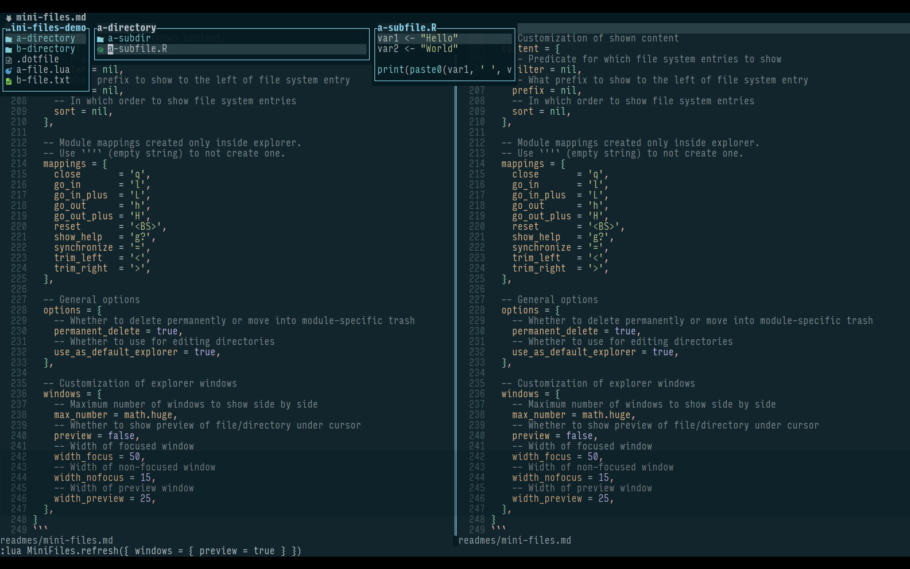

*원래 [Reddit에 게시됨](https://www.reddit.com/r/neovim/comments/14qb5l2/minifiles_updates_file_preview_prefix/)*

안녕하세요, Neovim 사용자 여러분!

약 2주 전에 열 보기 탐색과 "텍스트 편집을 통한 파일 시스템 조작" 디자인을 갖춘 [mini.nvim](https://github.com/nvim-mini/mini.nvim)의 파일 탐색기 모듈인 [mini.files](https://github.com/nvim-mini/mini.nvim/blob/main/readmes/mini-files.md)의 출시를 [발표했습니다](2023-06-22-announce-mini-files.qmd). 이에 대해 커뮤니티로부터 많은 피드백을 받았고, 그중 상당수가 새로운 기능으로 구현되었습니다.

보통은 출시 전에 거의 완성되기 때문에 플러그인 업데이트에 대한 후속 포스팅을 잘 하지 않지만, 이번에는 예외입니다.

'mini.files'에 새로 추가된 기능 목록입니다:

- **파일 미리보기** (하이라이트 포함): `windows.preview = true`로 설정하고 파일을 탐색해 보세요. 처음에는 코드 설계상의 이유로 이를 추가하는 것에 회의적이었습니다. 하지만 디렉터리는 미리보기가 보이고 파일은 보이지 않는 것이 깊은 단계의 탐색 과정에서 불편함을 초래했기에 마음을 바꿨습니다. 파일 미리보기에 텍스트 하이라이트를 효율적으로 추가하는 방법을 도와주신 /u/folke님께 큰 감사를 드립니다!

- `windows.width_preview`를 통한 **미리보기 너비 커스터마이징**. 이전 변경 사항에 따라 더 나은 파일 미리보기를 위해 필요하다고 생각했습니다.

- `content.prefix`를 통한 **접두사(아이콘) 커스터마이징**. 아이콘을 아예 표시하지 않는 것도 가능합니다 ( [도움말의 예시](https://github.com/nvim-mini/mini.nvim/blob/bb8ef7cfaf7b0c4492836f318df0b61e92ea3de1/doc/mini-files.txt#L369) 참조). 이 역시 코드 설계상 회의적이었으나, 커스터마이징 가능한 접두사를 가능하게 하는 더 나은 방법을 찾아냈습니다.

- `options.permanent_delete = false`를 통한 **비영구적 삭제**. 이는 파일/디렉터리를 표준 'data' 경로의 'mini.files/trash' 디렉터리로 이동시키는 모듈 전용 "휴지통으로 이동" 방식입니다. OS에 따라 달라지는 문제를 피하고자 일반 휴지통은 사용하지 않았습니다.

- 탐색기 내부에서 **새로운 대상 창(target window) 설정 가능**. [여기 예시](https://github.com/nvim-mini/mini.nvim/blob/bb8ef7cfaf7b0c4492836f318df0b61e92ea3de1/doc/mini-files.txt#L415)처럼 대상 창을 수직/수평 분할하는 매핑을 만들 수 있습니다 (이후 명시적으로 파일을 열어야 합니다).

- **파일 시스템 작업 성공 후의 이벤트** ( [이 목록](https://github.com/nvim-mini/mini.nvim/blob/bb8ef7cfaf7b0c4492836f318df0b61e92ea3de1/doc/mini-files.txt#L331) 참조). 출시 후 가장 먼저 받은 질문/요청 중 하나였는데, 이를 통해 `didCreateFiles`/`didRenameFiles`/`didDeleteFiles` LSP 알림을 활용할 수 있게 되었습니다.

- `go_in`/`go_out` 키에 대한 `[count]` 지원, 파일 시스템 작업 시 기존 데이터를 덮어쓰지 않도록 하는 등의 **다양한 소소한 개선**.

이상입니다. 'mini.files'는 'mini.nvim' 0.10.0 릴리스까지 한동안 베타 테스트 상태를 유지하겠지만, 기능적으로는 거의 완성되었다고 생각합니다.

아직 사용해 보지 않으셨다면 한번 사용해 보시고 의견을 들려주세요! 여기 댓글이나 (이미 꽤 북적이지만) [전용 베타 테스트 이슈](https://github.com/nvim-mini/mini.nvim/issues/377)를 통해 의견을 주시면 감사하겠습니다. 감사합니다!
