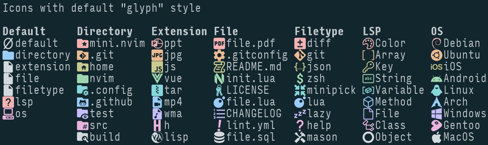
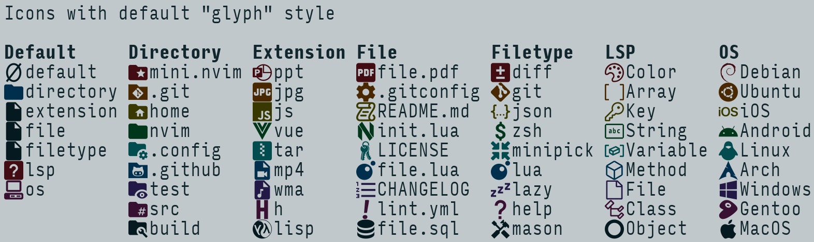
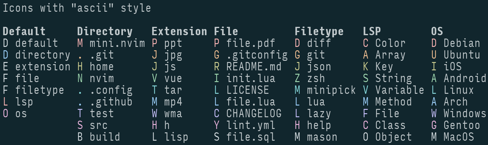

*원문: [Reddit 게시물](https://www.reddit.com/r/neovim/comments/1duf3w7/miniicons_general_icon_provider_several/)*

안녕하세요, Neovim 사용자 여러분!

범용 아이콘 제공을 목표로 하는 [mini.nvim](https://github.com/nvim-mini/mini.nvim)의 새로운 모듈 [mini.icons](https://github.com/nvim-mini/mini.nvim/blob/main/readmes/mini-icons.md)의 출시를 함께 축하해 주세요. 이 모듈은 [별도의 GitHub 저장소](https://github.com/nvim-mini/mini.icons)를 통해서도 설치할 수 있습니다.

------

최근 'mini.diff'와 'mini.git'의 출시로 'mini.statusline'에서 외부 의존성('lewis6991/gitsigns.nvim')을 하나 더 줄일 수 있게 되면서, 'nvim-tree/nvim-web-devicons'를 대체할 만한 기능을 'mini.nvim' 설계에 맞게 넣을 수 있을지 궁금해졌습니다. 아이콘을 위한 커스텀 솔루션이 있다면 적어도 4개 이상의 모듈(아마 그 이상)에 도움이 될 것이기에 충분히 가치 있는 일이라고 생각했습니다. 결국 저에게 잘 맞고 다음과 같은 몇 가지 아이디어에 기반한 접근 방식을 찾았습니다:

- 'nvim-web-devicons'와 같이 "아이콘과 하이라이트 그룹을 가져오는 하나의 메인 함수"라는 개념을 유지하되, 더 유연하고 미래 지향적으로 설계했습니다. 카테고리(예: "file", "extension", "directory" 등)와 아이콘 이름을 명시적으로 요구합니다 ('nvim-web-devicons'는 주로 "file", "extension", "filetype"만 가집니다).

- 'mini.nvim'의 기존 방식을 따라 모듈에서 사용되는 고정된 하이라이트 그룹 세트를 제공합니다. 이를 통해 컬러 스킴과의 통합(기본 제공 및 컬러 스킴 내부 모두)이 더 원활해지고 대량의 커스터마이징이 쉬워집니다.

- Nerd Fonts 글리프를 사용할 수 없지만 여전히 Neovim을 아름답게 사용하고 싶은 사용자를 위해 폴백을 제공합니다. 이는 `config.style = 'ascii'` 설정을 통해 가능합니다 (스크린샷 참조).

------

실제 코드 로직은 비교적 간단하지만, 'mini.icons'를 만들면서 가장 많은 시간이 걸린 부분은 다음과 같았습니다:

- 다양한 카테고리를 명시적으로 지원하기 위해 일반적인 사례들을 수집했습니다. 특히 'filetype' 지원에 가장 많은 노력을 기울였는데, 이는 더 풍부한 Neovim 통합을 위한 폴백으로 사용되기 때문입니다. 현재 지원되는 파일 유형(filetype)은 무려 780개에 달합니다!

- 각 아이콘을 일일이 확인하며 Nerd Fonts 글리프와 하이라이팅을 할당했습니다. 단조롭지만 즐거운 경험이었습니다.

- 'mini.icons' 출시 직후 더 나은 기본 사용자 경험을 제공하기 위해 인기 있는 Neovim 컬러 스킴들에 PR을 보냈습니다. 총 16개의 PR을 보냈습니다!

- 관련 모듈들이 'nvim-web-devicons' 대신 'mini.icons'를 선호하도록 업데이트했습니다 (물론 하위 호환성을 유지하면서요). 이제 'mini.statusline', 'mini.tabline', 'mini.files', 'mini.pick' 모두 (설정된 경우) 'mini.icons'를 사용합니다.

------

주요 기능:

- 다양한 카테고리(filetype, file/directory path, extension, operating system, LSP kind)에 대해 단일 `MiniIcons.get()` 함수를 통해 아이콘과 하이라이팅을 제공합니다. 아이콘과 카테고리의 기본값은 오버라이드할 수 있습니다.

- 설정 가능한 스타일: "glyph" (아이콘 글리프) 또는 "ascii" (글리프가 아닌 폴백).

- 컬러 스킴과 더 잘 어우러지도록 고정된 하이라이트 그룹 세트 제공 (기본적으로 내장 그룹에 링크됨).

- 최상의 성능을 위한 캐싱.

- `vim.filetype.add()` 및 `vim.filetype.match()`와 통합.

- 'mini.nvim' 외부의 플러그인과 더 잘 통합되도록 'nvim-tree/nvim-web-devicons'의 메서드를 모킹(mocking)합니다. [`MiniIcons.mock_nvim_web_devicons()`](https://github.com/nvim-mini/mini.nvim/blob/bc6c0f7b49d71716c996a9422a46bbe5badec8ca/doc/mini-icons.txt#L356)를 참조하세요.

------

'mini.icons'를 꼭 한번 사용해 보시길 진심으로 바랍니다. 결과적으로 일반 사용자와 플러그인 제작자 모두에게 'nvim-web-devicons'보다 더 나은 대안이 될 것이라고 생각합니다. [사용자를 위한 상세 비교](https://github.com/nvim-mini/mini.nvim/blob/bc6c0f7b49d71716c996a9422a46bbe5badec8ca/doc/mini-icons.txt#L58)와 [플러그인 제작자를 위한 상세 비교](https://github.com/nvim-mini/mini.nvim/blob/bc6c0f7b49d71716c996a9422a46bbe5badec8ca/doc/mini-icons.txt#L85)를 확인해 보세요. 또한, 설정에 `MiniIcons.mock_nvim_web_devicons()`를 추가하면 (아직) 'nvim-web-devicons'만 지원하는 다른 플러그인들과도 잘 작동할 것입니다.

한번 사용해 보시고 의견을 들려주세요! 제안 사항은 여기 댓글이나 [전용 베타 테스트 이슈](https://github.com/nvim-mini/mini.nvim/issues/1007)에 남겨주시면 감사하겠습니다.

감사합니다!
