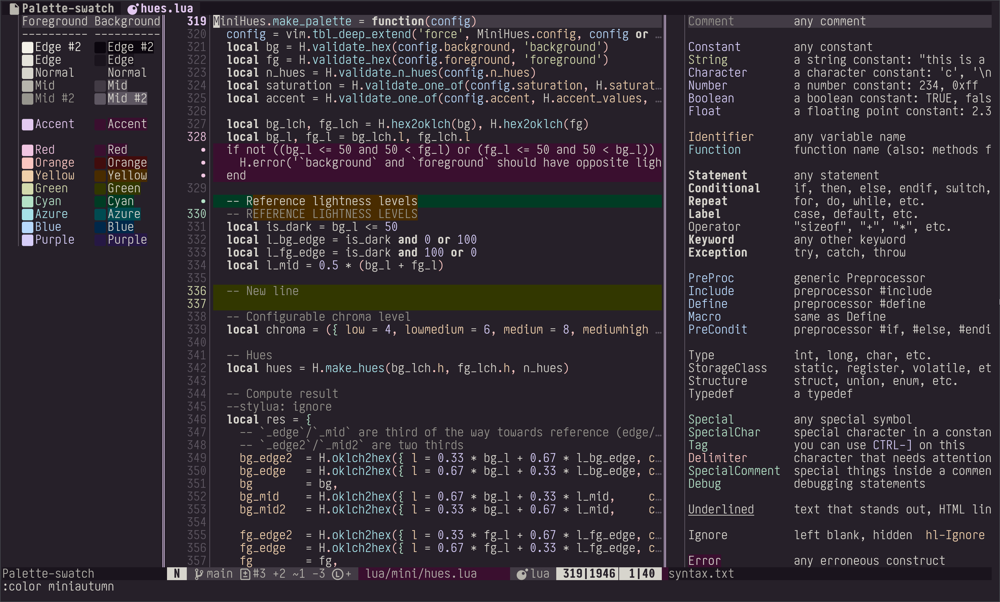
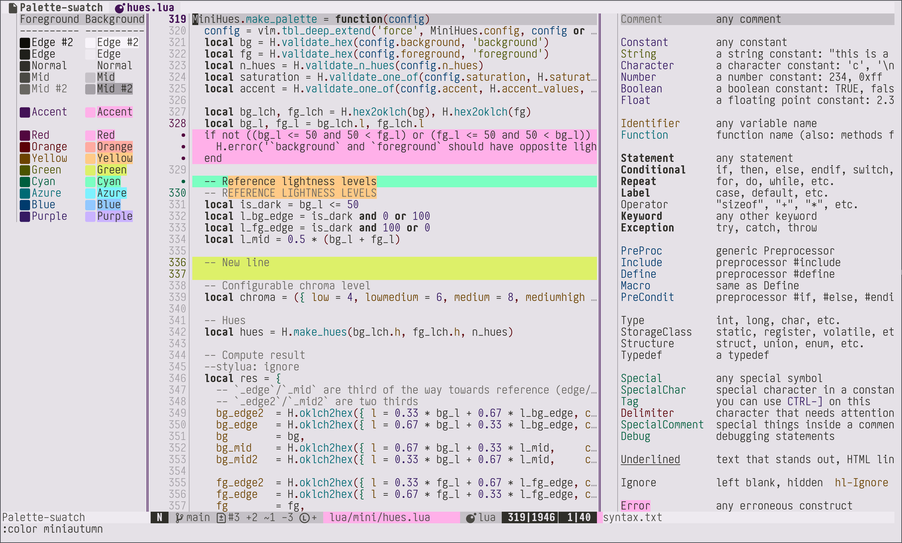
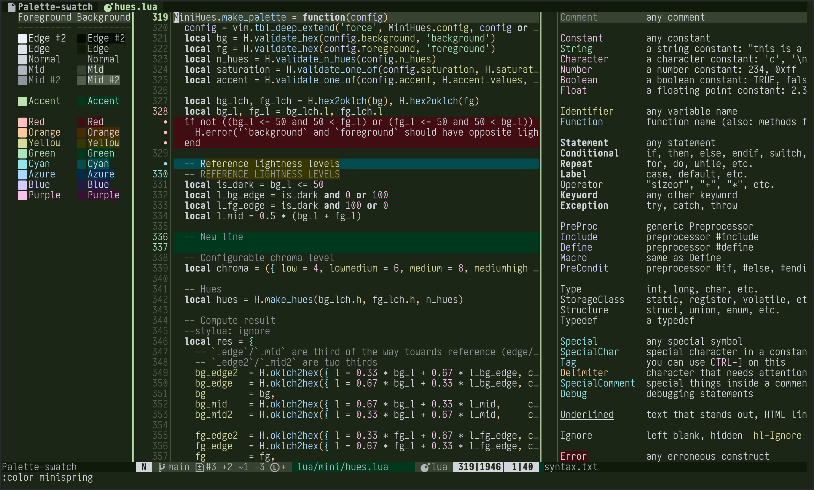
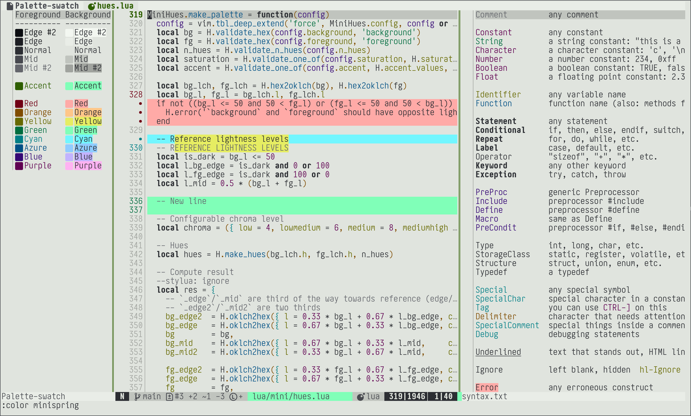
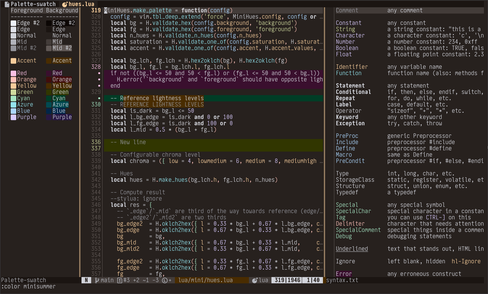
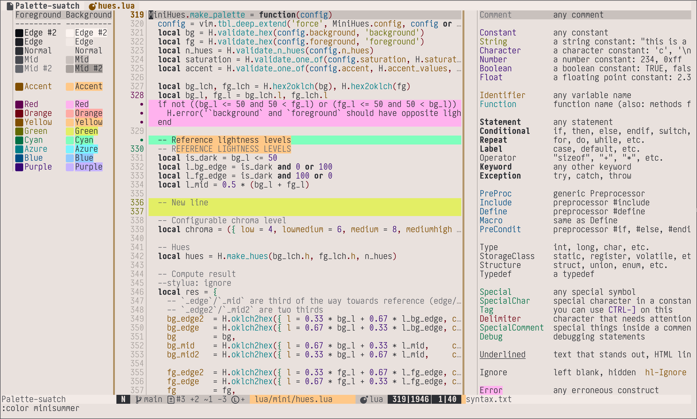
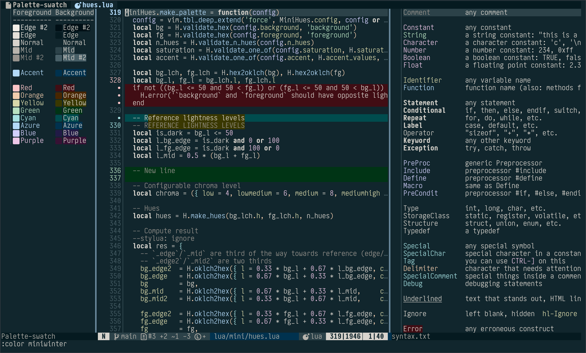
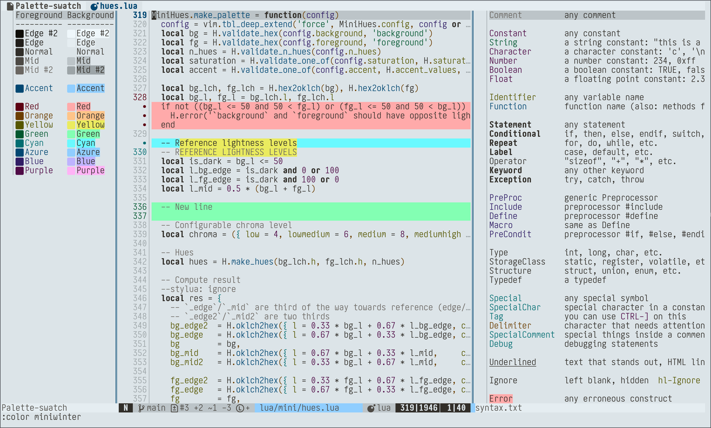

*원문: [Reddit 게시물](https://www.reddit.com/r/neovim/comments/1lwdit3/new_mininvim_color_schemes_miniwinter_minispring/)*

안녕하세요, Neovim 사용자 여러분!

꽤 오래전부터 [mini.hues](https://github.com/nvim-mini/mini.nvim/blob/main/readmes/mini-hues.md)를 기반으로 한 더 많은 컬러 스킴을 [mini.nvim](https://github.com/nvim-mini/mini.nvim)의 일부로 제공하고 싶었습니다. 매번 무작위로 생성되는 `randomhue`가 있긴 하지만, 데모나 새로운 사용자 경험을 위해서는 "고정된" 컬러 스킴이 유용하기 때문입니다.

이러한 생각은 "왜 계절에서 영감을 받은 컬러 스킴 세트는 없을까?"라는 호기심과 맞물렸습니다. 그래서 약 9개월 전부터 작업을 시작했고, 각 스킴의 다크 버전을 직접 메인으로 사용하며 다듬어왔습니다.

이제 마침내 공개할 때가 되었습니다. 새로운 컬러 스킴들을 소개합니다:

- `miniwinter`: 하늘색(azure) 배경의 "빙하 겨울" 팔레트.
- `minispring`: 녹색 배경의 "꽃피는 봄" 팔레트.
- `minisummer`: 갈색/노란색 배경의 "뜨거운 여름" 팔레트.
- `miniautumn`: 보라색 배경의 "선선한 가을" 팔레트.

저는 개인적으로 `miniwinter`를 가장 좋아합니다. 원래 하늘색/파란색 계열의 배경과 노란색/아이보리 계열의 전경색 조합을 선호하거든요. 또한 `minispring`이나 `minisummer`의 라이트 버전은 (찾기 힘든) 정말 쓸만한 라이트 컬러 스킴이라고 생각합니다.

한번 사용해 보시고 의견을 들려주세요! 현재 최신 `main` 브랜치의 'mini.nvim'에 포함되어 있으며, 독립된 [mini.hues](https://github.com/nvim-mini/mini.hues) 저장소에서도 만나보실 수 있습니다.

참고 사항:

- 스크린샷에 사용된 폰트는 "Input Mono" 폰트에서 영감을 받아 [매우 고도로 커스터마이징된 Iosevka 빌드](https://github.com/echasnovski/dotfiles/blob/master/fonts/.local/share/fonts/IosevkaInput/IosevkaInput-build-plans.toml)입니다.

감사합니다!
